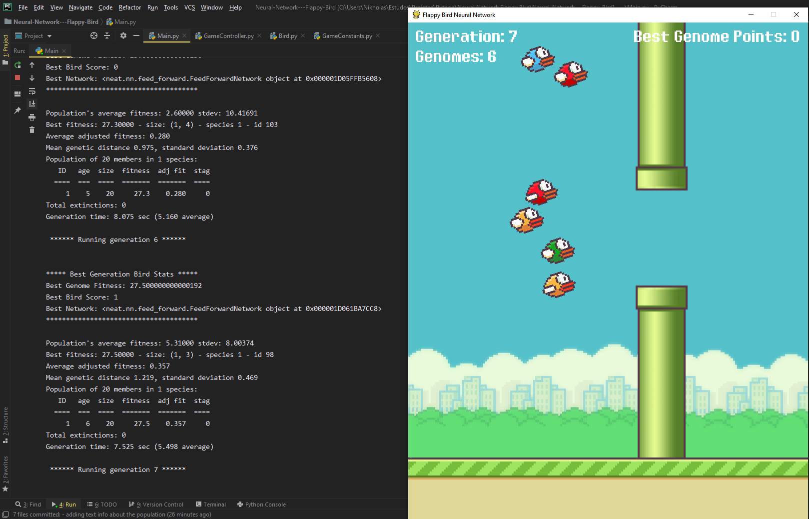

## Neural Network on Flappy Bird
A simple neural network learning how to play the game Flappy Bird using NEAT (NeuroEvolution of Augmenting Topologies)

## Motivation
Project created to study neural network development and implementation

## Features

- Flappy Bird copy game created with Pygame
- Implementation of NEAT in the game ( fitness function, fitness calculation, population handling, etc. )
- Object Oriented Programming

## Screenshots

## Tech/framework used

Built with

- 
- 
- 
- 

## About

Project created with academic purposes only

## License

MIT © Copyright (c) 2020 nikholasborges
